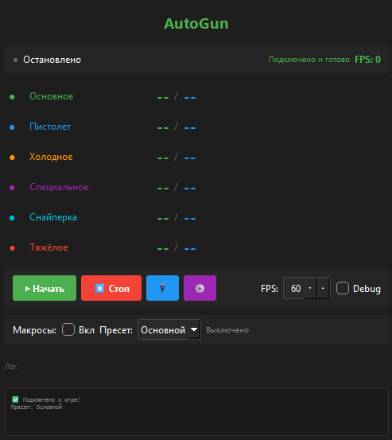
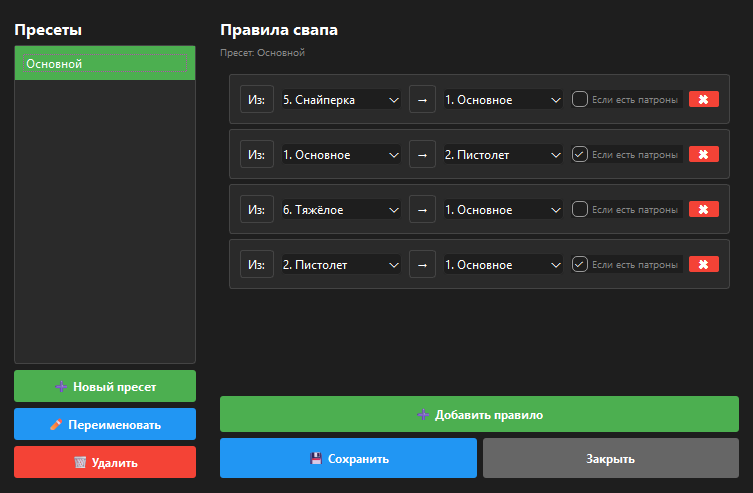

# AutoGun

Автоматический свап оружия для Pixel Gun 3D с отслеживанием патронов через чтение памяти.



---

## Зачем

- **Видеть патроны всех 6 оружий** одновременно в реальном времени
- **Автоматический свап** после выстрела по настраиваемым правилам

---

## Как работает

1. **Читает память игры** напрямую → получает патроны всех оружий
2. **Отслеживает выстрелы** (по уменьшению патронов в обойме)
3. **Автоматически жмёт клавиши** 1-6 для свапа по заданным правилам

---

## Установка

```bash
pip install -r requirements.txt
```

---

## Настройка

### 1. Найти оффсеты (один раз)

С помощью **Cheat Engine** найти адреса патронов в памяти игры.

**Инструкция:** `MEMORY_OFFSETS_GUIDE.md`

Полученные оффсеты вписать в `config/default_config.yaml`:

```yaml
memory_reading:
  offsets:
    weapon_slots_base: 0x059A58A0
    pointer_offsets: [0xB8, 0x0, 0x38, 0x120, 0x20]
    slot_1_reserve: 0x00
    slot_1_clip: 0x04
    slot_offset: 0x10
```

### 2. Настроить макросы (опционально)

Открыть настройки (кнопка ⚙️):
- Создать пресет
- Добавить правила: **Из: [оружие] → [оружие]**
- Сохранить



**Пример:**
```
Из: Снайперка → Основное ☑ Если есть патроны
Из: Основное → Пистолет ☑ Если есть патроны
```

---

## 🔨 Компиляция в EXE

### Быстрый способ (рекомендуется)

1. Активируйте виртуальное окружение:
```bash
venv312\Scripts\activate
```

2. Запустите компиляцию:
```bash
COMPILE.bat
```
или
```bash
python build_pyinstaller.py
```

**Результат:** `AutoGun.exe` (~50-100 МБ)  
**Время:** 5-15 минут

### ⚠️ Проблемы с Nuitka?

Если через Nuitka не работает (exe создаётся, но не запускается), используйте **PyInstaller** (метод выше).

**Подробная инструкция:** См. `COMPILE_GUIDE.md`

**Важно:** 
- Используйте Python 3.12 (не 3.13!)
- Запускайте exe из папки проекта (рядом должны быть config/ и data/)

---

## Использование

```bash
python main.py
```
или запустить `AutoGun.exe`

1. **Нажать "Переподключиться"** → должно показать "Подключено"
2. **Нажать "Начать"** → патроны обновляются в реальном времени
3. Выбрать пресет → включить макросы → готово

---

## Функции

### Отслеживание патронов
- Все 6 оружий на одном экране
- Обойма / Запас для каждого


### Макросы
- Пресеты с правилами свапа
- Проверка наличия патронов
- Автоматический свап после выстрела
- Сохранение настроек

---

## Структура

```
AutoGun/
├── main.py                    # Точка входа
├── config/
│   ├── default_config.yaml    # Оффсеты и настройки
│   └── user_settings.yaml     # Сохранённые параметры
├── src/
│   ├── core/
│   │   ├── memory_reader.py   # Чтение памяти
│   │   └── macro_engine.py    # Движок макросов
│   └── gui/
│       └── main_window.py     # Интерфейс
└── logs/
    └── ammo_tracker.log       # Логи
```

---

## Требования

- Python 3.10+
- Pixel Gun 3D (Desktop)

---

## Безопасность

✅ **Только чтение памяти** - не модифицирует игру  
✅ **Нажатие клавиш** - как обычный игрок  
⚠️ **После обновления игры** нужно заново найти оффсеты  

---

## FAQ

**Q: Не подключается к игре**  
A: Убедитесь что игра запущена, имя процесса `Pixel Gun 3D.exe`

**Q: Патроны показывают мусор**  
A: Игра обновилась - найдите оффсеты заново через Cheat Engine

**Q: Макросы не работают**  
A: Проверьте что клавиши в игре 1-6, выбран пресет, макросы включены


---

## Лицензия

MIT

---


